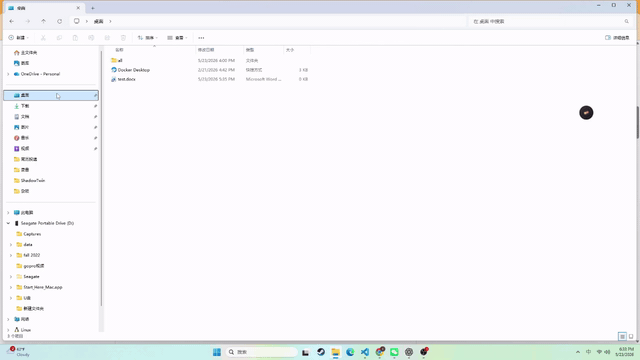
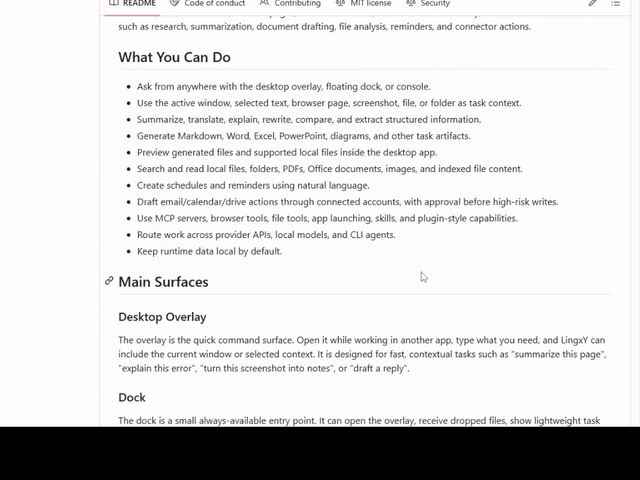

<p align="center">
  
</p>

# LingxY AI Desktop

<p align="center">
  <strong>本地优先的 Windows 桌面 AI 工作区，面向桌面上下文、文件、网页、Office 文档、定时任务和工具型任务。</strong>
</p>

<p align="center">
  
  
  
  
</p>

[English](README.md)

LingxY AI Desktop 是一个本地优先的 Windows 桌面 AI 工作区。它围绕你配置的模型服务商，提供桌面 overlay、dock、console、浏览器扩展、Office 加载项、文件工具、定时任务和连接器工作流。

它的目标很直接：让 AI 能真正理解桌面上下文，同时始终把控制权留给用户。LingxY 可以读取当前窗口、选中文本、浏览器页面、截图、文件、Office 文档和会话历史，然后执行调研、总结、文档生成、文件分析、提醒、连接器草稿等带工具调用的任务。

## 功能亮点

| 亮点 | 作用 |
| --- | --- |
| 桌面 Overlay | 在任意应用上方打开轻量命令窗口，结合当前窗口、选中文本、文件、网页或截图提问。 |
| 文件和文件夹理解 | 分析文档、图片、PDF、Office 文件、文件夹，也支持类似“这两个文件夹里有多少 .docx 文件”的过滤清点。 |
| 浏览器和视频上下文 | 通过浏览器扩展解释当前网页、选中文本、链接、图片和支持的视频页面。 |
| Console 工作区 | 集中管理会话、任务、产物、预览、模型服务商、定时任务、连接器、笔记和审批。 |
| 自带模型服务商 | 可路由到已配置的 API 服务商、本地端点，或 Claude Code、Codex、Kimi CLI 等 CLI agent。 |
| 高风险动作先审批 | 邮件、日历、文件和连接账号写入类动作会先生成草稿或审批项，由用户确认后再执行。 |

## 演示

| 快捷键捕获文件 | 网页和选中文字分析 | 拖动文件分析 |
| --- | --- | --- |
| 使用全局快捷键捕获桌面选中的文件，并让 LingxY 分析。 | 从浏览器扩展解释当前网页或选中文字，并在侧边栏继续追问。 | 把本地文件拖入 LingxY，直接开始上下文分析。 |
|  |  |  |

## 你可以用它做什么

- 通过桌面 overlay、悬浮 dock 或 console 随时提问。
- 把当前窗口、选中文本、浏览器页面、截图、文件或文件夹作为任务上下文。
- 总结、翻译、解释、改写、对比和抽取结构化信息。
- 生成 Markdown、Word、Excel、PowerPoint、图表和其他任务产物。
- 在桌面应用里预览生成文件和受支持的本地文件。
- 搜索和读取本地文件、文件夹、PDF、Office 文档、图片和已索引文件内容。
- 用自然语言创建定时任务和提醒。
- 通过连接账号起草邮件、日历、网盘动作，并在高风险写入前先让你审批。
- 使用 MCP 服务、浏览器工具、文件工具、应用启动、Skills 和插件式能力。
- 在 API 服务商、本地模型和 CLI agent 之间路由任务。
- 默认把运行时数据保留在本机。

## 主要界面

### Desktop Overlay

Overlay 是快速命令入口。你可以在其他应用上方打开它，输入需求，LingxY 会尽量带上当前窗口或选中内容。它适合快速上下文任务，比如“总结这个页面”“解释这个错误”“把截图整理成笔记”“帮我起草回复”。

### Dock

Dock 是一个小型常驻入口。它可以打开 overlay、接收拖拽文件、显示轻量任务状态，让你不必切到完整 console 也能开始任务。

### Console

Console 是主工作区。你可以在这里管理会话、任务、文件、定时任务、连接器、笔记、模型服务商、审批和运行时设置。Console 也提供英文和中文 UI 模式切换。

### 浏览器扩展

浏览器扩展让 LingxY 能使用网页内容、选中文本和浏览器侧状态。当任务依赖当前网页、文章或浏览器会话时，可以启用它。

### Office 加载项

Office 加载项提供 Word、Excel、PowerPoint 入口，让文档和表格可以作为任务上下文，生成结果也能进入 Office 工作流。

## 模型与服务商支持

LingxY 使用自带服务商配置模式。你可以在桌面 console 里配置想用的服务商。

支持的服务商和运行时包括：

- OpenAI-compatible API
- DeepSeek
- Anthropic
- Kimi
- Ollama 和本地端点
- Claude Code、Codex、Kimi CLI 等 CLI agent

实际可用能力取决于你在本机配置的 API Key、本地工具和服务端点。

## 安全模型

LingxY 的设计重点是明确的用户控制。

- 本地优先运行时数据：任务、会话、产物、服务商设置和运行状态保存在你的电脑上。
- 副作用先审批：发送邮件、创建日历事件、上传文件、修改连接账号等高风险动作会先生成草稿或审批项，由你确认后再执行。
- 密钥卫生：不要提交 `.env`、服务商 Key、OAuth 凭据、运行时数据库、日志、任务报告或生成产物。
- 公开导出：内部 verifier 清单、release evidence、真实 API 报告、下载模型和本地运行时数据不会包含在这个公开仓库里。

## 环境要求

- Windows 10 或更高版本
- Node.js `>=22.12.0 <23`
- npm
- Git

可选能力可能还需要：

- 模型服务商 API Key 或本地模型端点
- 用于本地语音/OCR 的 Python 辅助组件
- 浏览器扩展安装
- Office 加载项 sideload
- 连接器 OAuth 凭据
- MCP 服务配置

## 快速开始

克隆仓库：

```powershell
git clone https://github.com/hxyder/LingxY-AI.git
cd LingxY-AI
```

安装依赖：

```powershell
npm ci
```

运行公开检查：

```powershell
npm run check:public
```

启动本地 runtime：

```powershell
npm run start:runtime
```

另开一个 PowerShell 窗口，启动桌面应用：

```powershell
npm run start:desktop
```

桌面应用打开后，先在 console 设置里配置至少一个模型服务商。

## 首次配置

1. 启动 runtime 和桌面应用。
2. 打开 LingxY console。
3. 进入 Settings。
4. 添加模型服务商或本地模型端点。
5. 选择聊天和工具任务的默认路由。
6. 可选：从 `browser_ext/` 安装浏览器扩展。
7. 可选：从 `office_addin/` sideload Office 加载项。
8. 可选：配置 MCP 服务和账号连接器。
9. 通过 overlay、dock 或 console 开始任务。

## 常见工作流

### 询问当前窗口

在其他应用或浏览器标签页处于活动状态时打开 overlay，然后输入：

```text
Summarize the current page and list the key action items.
```

LingxY 会根据启用情况使用当前窗口、浏览器扩展、截图辅助或选中文本作为上下文。

### 处理文件和文件夹

把文件拖到 dock，或在 console 中添加文件，然后输入：

```text
Compare these documents and create a short decision brief.
```

支持的流程包括文件读取、文件夹遍历、文档渲染、产物生成和预览。

### 生成文档

直接要求一个交付物：

```text
Create a one-page project status report as a Word document.
```

生成的产物会出现在任务输出中，并可在 console 里预览。

### 创建提醒

使用自然语言：

```text
Remind me every weekday at 9 AM to review my task list.
```

你可以在 console 里查看和管理定时任务。

### 使用连接器

配置账号后，可以让 LingxY 起草连接器动作：

```text
Draft an email summary of this report for my team.
```

写入类动作默认先审批。你需要先查看草稿，再确认执行。

## 常用命令

```powershell
npm test
npm run check:public
npm run smoke:runtime
npm run smoke:desktop
npm run smoke:ui-i18n
npm run start:runtime
npm run start:desktop
npm run pack
npm run dist
```

命令说明：

- `npm test`：运行公开行为测试子集。
- `npm run check:public`：运行公开仓库卫生检查、行为测试、UI i18n smoke、桌面入口 smoke 和 runtime health smoke。
- `npm run smoke:runtime`：启动测试 runtime 并检查 `/health`。
- `npm run smoke:desktop`：验证桌面入口和 manifest 合同。
- `npm run smoke:ui-i18n`：检查公开 UI 语言切换 wiring 是否存在。
- `npm run pack`：生成未打包安装器的 Electron 构建目录。
- `npm run dist`：生成安装器产物。

## 仓库结构

```text
src/                 应用运行时、桌面 shell、工具和连接器
assets/              品牌与应用资源
browser_ext/         浏览器扩展集成
office_addin/        Word、Excel、PowerPoint 加载项
uca-cli/             CLI 入口
uca-native-host/     Native messaging host
scripts/             运行时、安装、打包和公开 smoke 脚本
tests/behavior/      少量公开行为测试
docs/                runtime、隐私、浏览器、定时任务和协议文档
tools/               发布辅助元数据
external/            可选本地运行时和模型的占位目录
```

## 配置说明

- 模型服务商和连接器请在桌面 console 中配置。
- 密钥不要进入 Git。请使用本地环境变量、系统凭据存储或 console 管理的本地配置。
- 本地运行时数据不应提交。
- 下载的模型引擎、OCR 和语音运行时应放在已忽略的本地路径下。
- 公开 CI 使用轻量公开检查，不包含内部 verifier corpus。

## 浏览器扩展

浏览器扩展源码在 `browser_ext/`。开发时可在 Chromium 系浏览器中以 unpacked extension 方式加载。扩展用于捕获网页上下文、选中文本和浏览器侧状态。

见 [browser_ext/README.md](browser_ext/README.md)。

## Office 加载项

Office manifest 和共享 task pane 代码在 `office_addin/`。如果需要让 Word、Excel 或 PowerPoint 参与 LingxY 工作流，可以 sideload 对应 manifest。

见 [office_addin/README.md](office_addin/README.md)。

## MCP、Skills 和工具

LingxY 可以通过 MCP 服务、内置工具、连接器工具和 skill 风格工作流暴露和调用工具能力。你可以在 console 里配置 MCP 服务和可用能力。

## 开发说明

这个仓库是干净的公开源码导出。它保留应用代码和小型公开测试面，同时排除了内部 release evidence、真实 API 报告、大型 verifier 清单、运行时数据库、本地模型和私有配置。

贡献代码时，请保持改动范围清晰，并为用户可见行为添加聚焦测试或 smoke 检查。

## 排障

- 如果 `npm ci` 提示 Node engine mismatch，请安装 Node `22.12.x` 或 23 以下的较新 Node 22 版本。
- 如果 `smoke:runtime` 提示测试端口被占用，请停止占用该端口的 LingxY runtime 后重试。
- 如果桌面应用能打开但不能回答，请先配置模型服务商。
- 如果缺少浏览器上下文，请确认扩展已安装，并且允许在当前网站运行。
- 如果 Office 集成不可用，请确认加载项 manifest 已 sideload，且本地 runtime 正在运行。

## 许可证

MIT。见 [LICENSE](LICENSE)。
