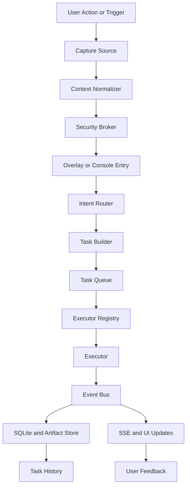

# Data Flow

## Purpose

Describe the end-to-end flow from captured context to stored result.

## Flow

## Required Invariants

- Every context packet passes through the security layer before external execution.
- Every task event is persisted before it is broadcast to the UI.
- Every artifact is linked back to a task identifier.
- Every long-running execution path is replayable from persisted events.

## Phase 1 Baseline Path

For the first executable loop, the flow is:

1. user opens fixed overlay
2. clipboard text is captured
3. context is normalized
4. user picks a quick action
5. task is created and queued
6. fast executor streams output
7. events are stored and shown
8. result is available in task history
