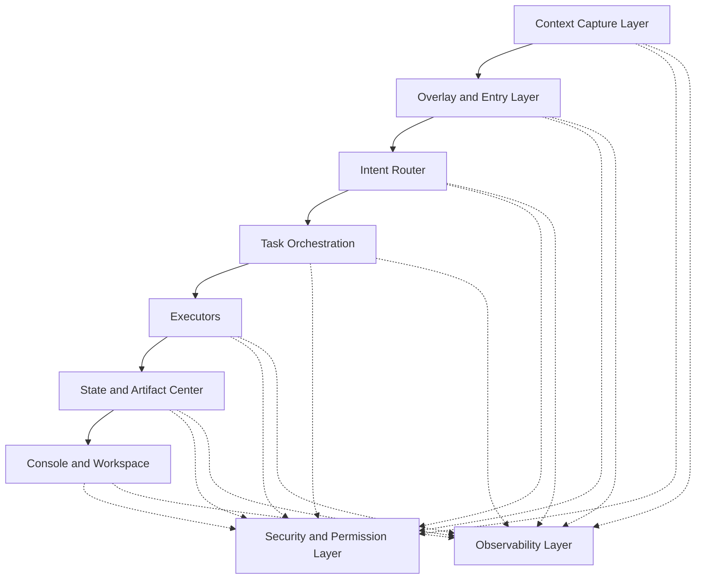

# Layer Overview

## Purpose

Define the major system layers and their responsibilities so later implementation work can align around stable boundaries.

## Layer Model

## Responsibilities

### 1. Context Capture Layer

- receives raw signals from clipboard, file selection, browser extension, Office add-in, screenshots, and helper processes
- normalizes raw input into a shared context shape

### 2. Overlay and Entry Layer

- presents low-interruption entry points
- shows quick actions and lightweight context summaries

### 3. Intent Router

- converts user command plus context into an execution decision
- chooses fast, tool-using, or deep executor paths

### 4. Task Orchestration

- creates tasks
- handles queueing, concurrency, retries, and state transitions

### 5. Executors

- run concrete work through LLMs, code CLIs, OCR, fetchers, or action tools

### 6. State and Artifact Center

- persists task metadata, events, and output locations
- provides replayable task history

### 7. Console and Workspace

- shows task lists, details, logs, outputs, and configuration

### 8. Security and Permission Layer

- enforces blocklists, redaction, presenter mode, audit, and approval rules

### 9. Observability Layer

- provides metrics, logging, crash recovery, and trace identifiers

## Phase 1 Boundary

Phase 1 may implement simplified versions of these layers, but the layer boundaries themselves should remain stable.
