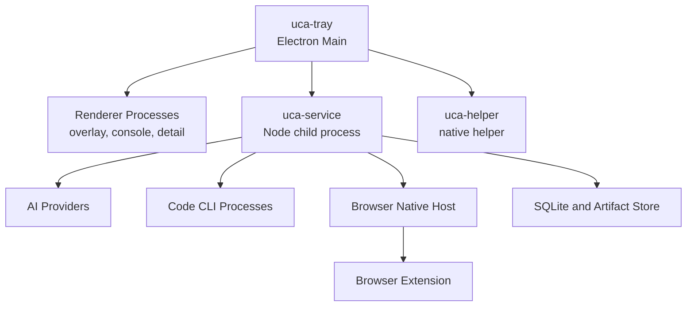

# Process Topology

## Purpose

Define the initial target process split and the responsibility of each process.

## Topology

## Responsibility Table

| Process | Main Responsibility | Notes |
|---|---|---|
| `uca-tray` | tray icon, window lifecycle, startup, shortcut registration | UI shell only |
| `renderer` | overlay, console, task detail views | no core business logic |
| `uca-service` | task routing, queue, state persistence, executor orchestration | main application brain |
| `uca-helper` | native OS integration such as screenshots and Explorer selection access | kept separate from Electron |
| `uca-native-host` | browser extension bridge | launched by browser |
| code CLI subprocess | deep execution tasks | isolated per task where possible |

## Process Rules

- Renderers do not call LLMs directly.
- Service owns storage access.
- Native helper owns OS-specific capture and integration logic.
- Browser extension communication is isolated behind its host bridge.

## Phase 1 Implementation Note

Phase 1a can defer the native helper if Electron-native APIs are enough for the first loop, but the topology above remains the target architecture.
