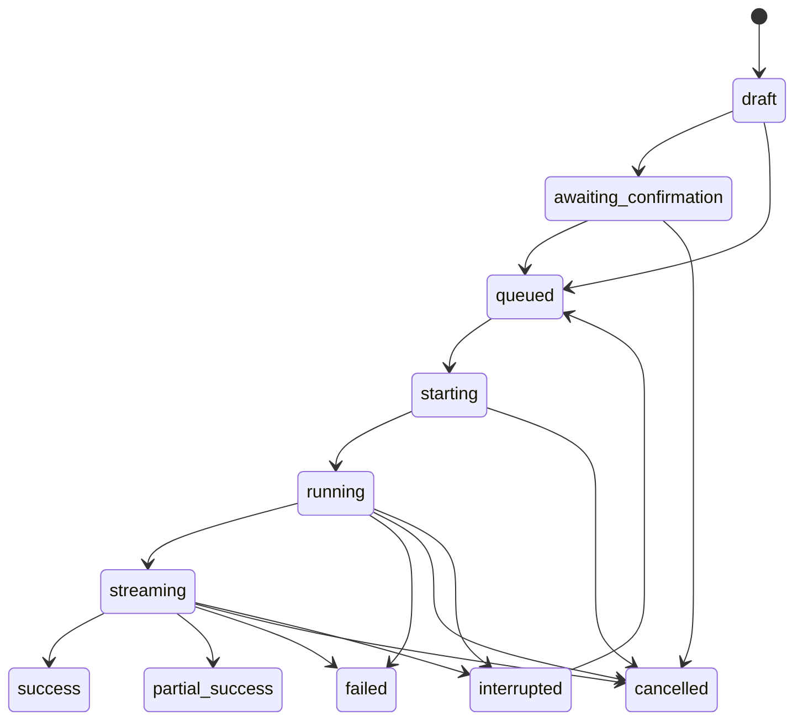
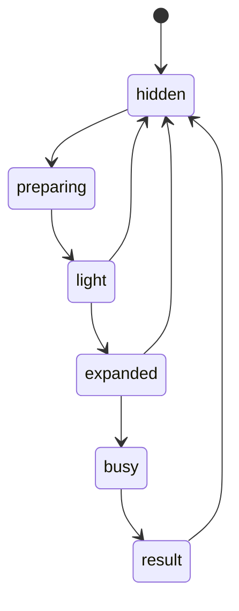
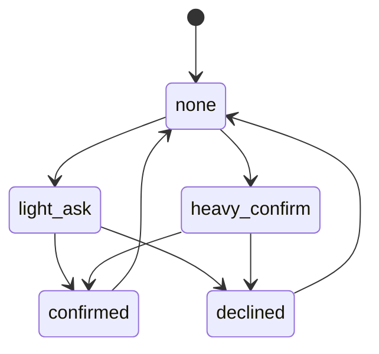

# State Machines

## Task FSM

```mermaid
stateDiagram-v2
    [*] --> draft
    draft --> awaiting_confirmation
    draft --> queued
    awaiting_confirmation --> queued
    awaiting_confirmation --> cancelled
    queued --> starting
    starting --> running
    running --> streaming
    running --> failed
    streaming --> success
    streaming --> partial_success
    streaming --> failed
    starting --> cancelled
    running --> cancelled
    streaming --> cancelled
    running --> interrupted
    streaming --> interrupted
    interrupted --> queued
```

## Overlay FSM

```mermaid
stateDiagram-v2
    [*] --> hidden
    hidden --> preparing
    preparing --> light
    light --> expanded
    expanded --> busy
    busy --> result
    result --> hidden
    expanded --> hidden
    light --> hidden
```

## Confirmation FSM

```mermaid
stateDiagram-v2
    [*] --> none
    none --> light_ask
    none --> heavy_confirm
    light_ask --> confirmed
    light_ask --> declined
    heavy_confirm --> confirmed
    heavy_confirm --> declined
    confirmed --> none
    declined --> none
```
